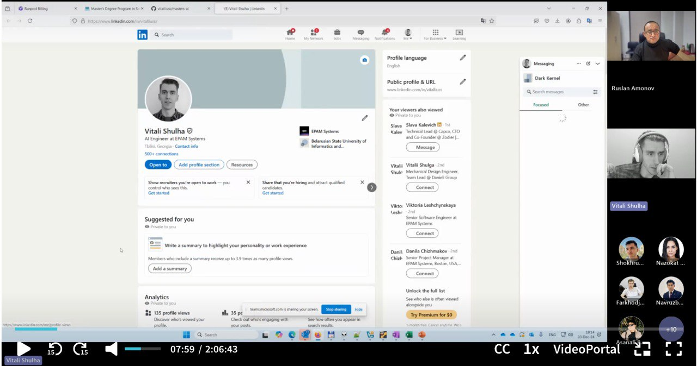
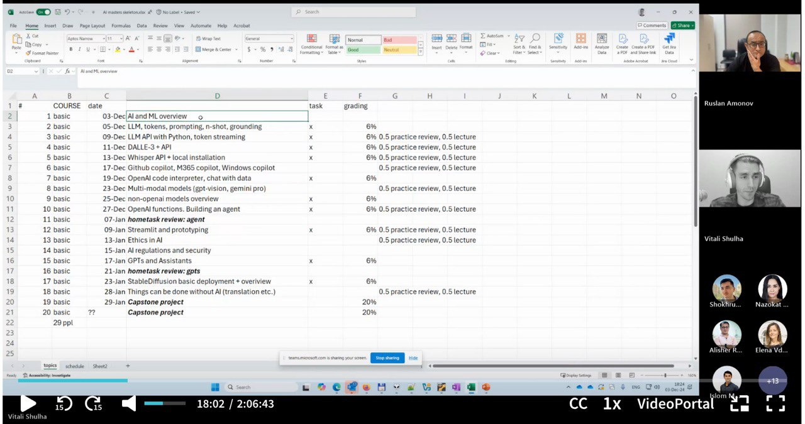
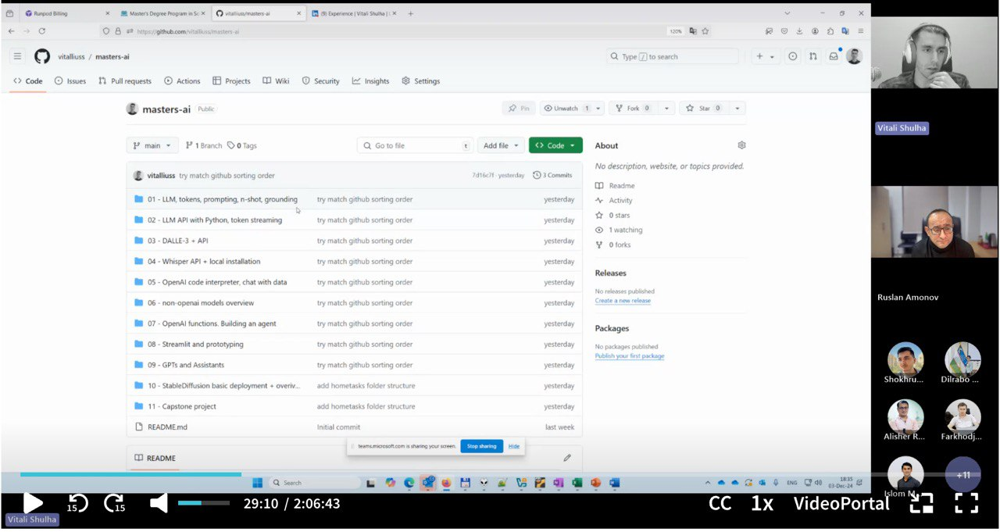

# First Lecture Recap: Generative AI and Machine Learning

Welcome to the journey of mastering Generative AI! Here’s a detailed recap of our first lecture, packed with insights into artificial intelligence, machine learning, and the foundational skills needed to succeed in this domain.

---
## Images from the Lecture

### LinkedIn Profile Demonstration

### Course Overview and Schedule

### Github Repositiry

## Lecture Highlights

### 1. **Introduction to the Course**
- The course is part of a master's degree program and is focused on generative AI and its applications.
- **Key Topics:** 
  - AI vs. ML vs. Data Science
  - Practical tasks and coding sessions
  - Capstone project overview
- Structure: A blend of lectures, practical demos, and hands-on coding tasks.

### 2. **About the Lecturer**
- 13 years of experience in IT, specializing in automated testing and AI engineering.
- Expertise in designing educational programs and jump-starting careers for over 300 junior engineers.
- Current role: Building multi-agent orchestration frameworks and applying AI in software development lifecycles.

### 3. **Course Framework**
- Key focus areas: AI, large language models (LLMs), Python coding, API integration, image generation, and ethics in AI.
- Tools and frameworks: OpenAI, PyTorch, TensorFlow, and Azure.

---

## Key Concepts Discussed

### **Artificial Intelligence (AI)**
AI systems aim to mimic human behavior, solving problems and performing tasks typically requiring human intelligence.

### **Machine Learning (ML)**
ML involves training algorithms to learn from data and improve their performance over time. Topics included:
- Neural networks and deep learning
- Large language models (LLMs) like GPT
- Frameworks: PyTorch and TensorFlow

### **Practical Applications**
- Transition from face-to-face to online education using AI tools.
- Developing AI systems for enterprise needs and fine-tuning models for specific tasks.

---

## Course Plan

### Timeline
- Weekly sessions with practical tasks.
- Grading: 60% from home tasks and 40% from the capstone project.

### Home Tasks
- Hands-on exercises with coding and AI problem-solving.

---

## Final Thoughts

This lecture laid the groundwork for understanding the vast potential of AI and ML. It’s an exciting time to explore, innovate, and contribute to this transformative field.

Stay tuned for the next lecture on **LLMs and Advanced Prompting Techniques**!

---

**Resources:**
- PyTorch tutorials for machine learning enthusiasts.
- TensorFlow Playground for visualizing neural networks.

