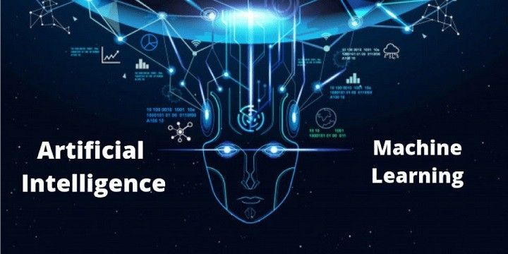
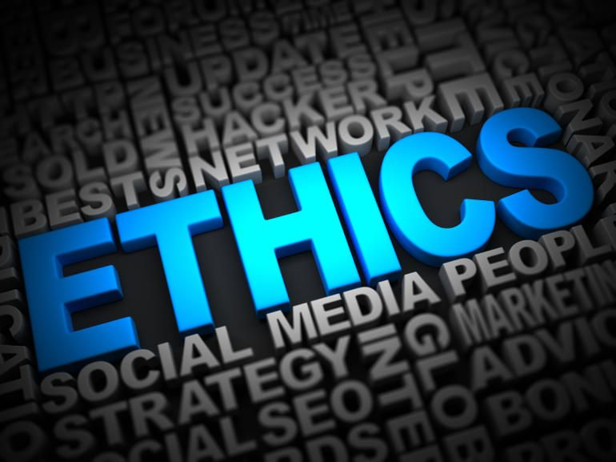

# Unveiling the World of Generative AI: Insights from Lecture 1

As digital transformation accelerates, generative AI continues to intrigue students, experts, and industry leaders. The inaugural lecture of our Master’s program on Generative AI provided an engaging introduction to this evolving discipline. Conducted by our instructor, Vitaliy, the session blended fundamental AI principles with real-world applications. Below is a summary of the most significant insights.

---

## Meet the Instructor

Vitaliy started by sharing his extensive experience, which spans 13 years in IT, software testing, and academia. Beginning as an integration test specialist, he later progressed to a leadership role in education at EPAM Systems, overseeing training initiatives across Western and Central Asia. Currently, he operates as an AI engineer, working on multi-agent orchestration frameworks that optimize software development pipelines, underscoring the real-world utility of generative AI.

---

## Fundamental Concepts: AI vs. Machine Learning

During the session, we explored key terminologies:

- **Artificial Intelligence (AI):** Encompasses a broad range of technologies designed to emulate human cognition, from virtual assistants to decision-making systems.
- **Machine Learning (ML):** A specialized branch of AI centered around developing algorithms that improve through data-driven learning. Neural networks and deep learning are integral to this domain.
- **Natural Language Processing (NLP):** Acts as a bridge between human speech and computational interpretation, enabling functionalities such as sentiment analysis, text summarization, and automated translations.

---

## Course Structure and Key Modules

This program integrates theoretical exploration with hands-on experimentation. Some of its core components include:

### Curriculum Highlights:
- Introduction to AI and ML concepts
- Deep dives into LLMs (Large Language Models)
- API-based AI implementations in Python
- Generative methods for images and audio
- Ethics, governance, and AI applications in business

### Practical Learning:
- Participants will engage in prototyping, develop lightweight AI-driven applications with frameworks like Streamlit, and explore open-source alternatives to commercial AI models.

### Capstone Project:
- A final project that applies generative AI to practical business scenarios, integrating multiple technologies for an end-to-end solution.

---

## Recommended Resources and Tools

To enhance learning, Vitaliy suggested various platforms and technologies:

- **Version Control:** GitHub is recommended for tracking assignments and collaborative work.
- **Programming Language:** Python remains the primary language due to its robust AI ecosystem.
- **Key Libraries & Frameworks:**
  - **PyTorch:** Recognized for its flexibility in deep learning applications.
  - **TensorFlow Playground:** A visual environment for comprehending neural network behavior.
- **AI Ecosystem:** Discussions highlighted OpenAI’s GPT models alongside open-source alternatives like Llama and Anthropic Cloud.

---

## Real-World Implementations

Vitaliy also emphasized:

- **Cutting-Edge Models:** Top-tier AI architectures that establish new performance benchmarks.
- **Data Curation:** Properly structured and preprocessed datasets are crucial for model efficiency.
- **Practical Constraints:** While generative AI offers immense potential, its real-world deployment often necessitates trade-offs between precision and resource consumption.

---

## Ethical Considerations and Data Security

The discussion also covered AI ethics, particularly:

- Mitigating risks by avoiding the use of sensitive data in public cloud-based AI models.
- Exploring self-hosted open-source models for more secure deployments.
- Understanding the reliability of leading cloud providers while being aware of potential security challenges.

---

## Looking Ahead

Vitaliy wrapped up the session with an inspiring message about AI’s transformative capabilities. He encouraged students to stay inquisitive, experiment with emerging tools, and apply generative AI techniques innovatively.

