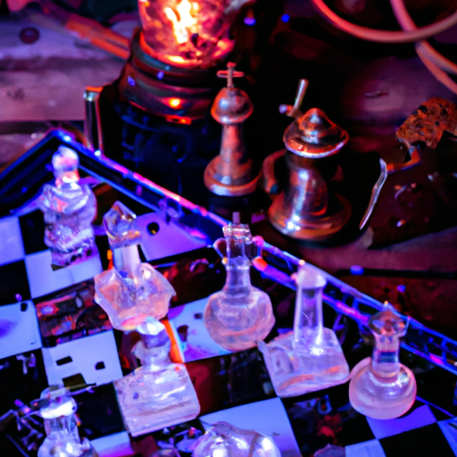

# Image Generator Tool

Welcome to the **Image Generator Tool**, a Python-based script designed to generate images in various artistic styles using OpenAI's DALL·E API. Below is a guide on how to set up, run, and use this tool effectively.

---

### Image Generation Prompt:
*Prompt*: Chess desk with neon lights and glass figures.


## Features
- Generate images based on your textual prompts.
- Supports multiple artistic styles, including:
  - Abstract Art
    
  
  - Realism

    
  - Cartoon Style
    
    
  - Impressionism

       
  - Surrealism

       
  - Cyberpunk

      
  - Steampunk
    
      
  - Pixel Art

      
  - Watercolor Painting (Error)
  
- Saves image URLs locally in the `generated_images` folder.

---

## Prerequisites
To use this tool, you need:
1. Python 3.8 or higher installed on your system.
2. An OpenAI API key.
3. `dotenv` and `openai` Python libraries installed.

Install the required libraries using:
```bash
pip install openai python-dotenv
