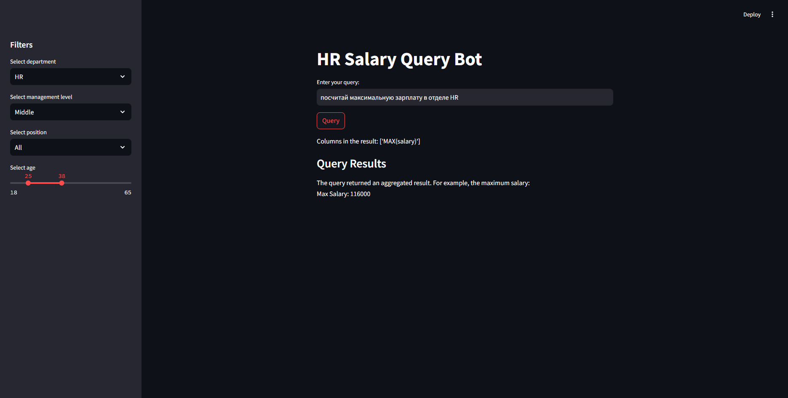

# **HR Salary Query Bot - Application Overview**

This document provides an overview of the main features of the **HR Salary Query Bot** application built with **Streamlit** and designed to query employee data stored in the `employers.db` database. The application provides a user-friendly interface to interact with the data and view results.

---

## **1. Application Interface**

The application has an intuitive and simple user interface that allows users to filter and customize their reports. The **Filter Panel** is a key feature of the app, offering users various filter options to narrow down the results based on specific criteria. 

### **Filter Panel:**
- Users can configure the report by choosing different filter options.
- These filters allow for specifying conditions such as **department**, **salary range**, **age**, and other employee attributes.
- Once the filters are set, the data is dynamically adjusted according to the specified criteria.

The panel enables an interactive way of querying the database without needing to write SQL queries manually. It helps streamline the process and makes the app more user-friendly.



---

## **2. Text Input Field**

The **Text Input Field** is where users can enter free-form queries in natural language. 

### **How It Works:**
- The program converts the user input into an SQL query using the functionality of **Streamlit**.
- This SQL query is then executed against the `employers.db` database to fetch the relevant data.
  
For example, a user could type:
- "Show me the employees in the Marketing department with a salary greater than 5000."
- The system will parse this query, convert it to an appropriate SQL statement, and retrieve the necessary results from the database.

### **SQL Query Construction:**
- The input text is parsed to identify keywords (such as department name, salary value, etc.).
- The application then builds an SQL query dynamically and executes it on the database to fetch the required records.


---

## **3. Response Area**

The **Response Area** is where the results of the query will be displayed. 

### **How It Works:**
- After the query is executed, the application displays the response in a readable format.
- The results are shown in a structured, easy-to-read layout with columns representing the employee's **name**, **position**, **salary**, and other relevant information.
- In addition to the data, a **Pie Chart** is displayed at the bottom of the response area, showing the distribution of salaries across different departments.

This section serves as the main output area for the application and presents the query results in a clear and organized way.


---

## **4. Logging**

The **Logging** feature is built into the application to track all user queries and database interactions. It provides visibility into how the system is being used and helps maintain security and operational integrity.

### **How It Works:**
- All user interactions with the application, including the text queries entered and the results of SQL queries, are logged into a database.
- Logs contain the **timestamp**, **user IP address**, the **user query**, and the **result** of the SQL query executed.
- This allows for easy tracking of user actions and troubleshooting if any issues arise.

The log data is stored in the `employees.db` database under the **logs** table and can be queried for audits or analysis.


---

## **Security Countermeasures**

While building the HR Salary Query Bot, it’s important to consider various security risks that may arise during its usage. Below are the key security considerations and countermeasures that should be implemented to safeguard the application and its data:

### **1. SQL Injection Prevention**

**Issue:**
SQL injection attacks occur when user input is improperly handled and inserted directly into SQL queries, allowing attackers to execute arbitrary SQL code.

**Countermeasure:**
- Use **parameterized queries** or **prepared statements** to prevent direct injection of user inputs into SQL queries.
- Example:
  ```python
  cursor.execute("SELECT * FROM employees WHERE department=?", (user_input,))
