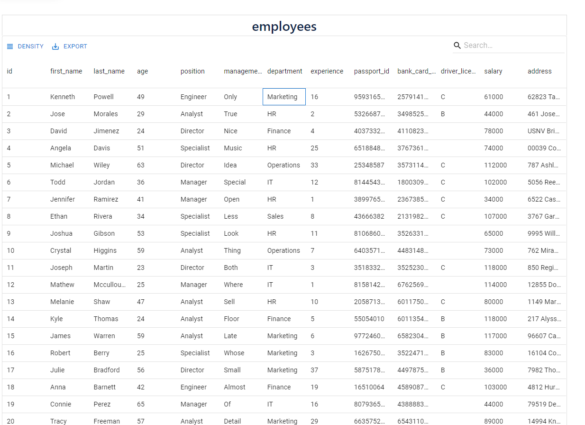
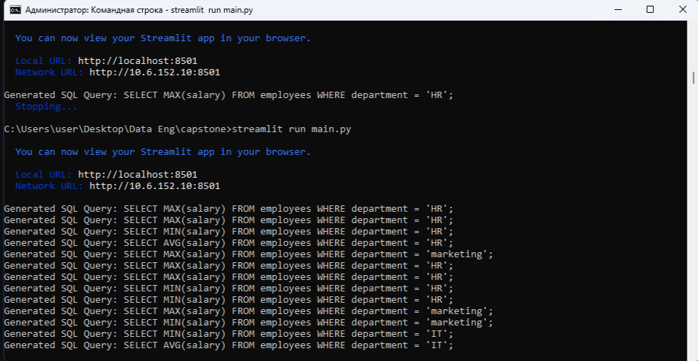

# HR Salary Query Bot - Application Overview

This document provides an overview of the main features of the **HR Salary Query Bot** application built with **Streamlit** and designed to query employee data stored in the `employers.db` database. The application provides a user-friendly interface to interact with the data and view results.

---

## 1. Application Interface

The application has an intuitive and simple user interface that allows users to filter and customize their reports. The **Filter Panel** is a key feature of the app, offering users various filter options to narrow down the results based on specific criteria. 

### Filter Panel:
- Users can configure the report by choosing different filter options.
- These filters allow for specifying conditions such as **department**, **salary range**, **age**, and other employee attributes.
- Once the filters are set, the data is dynamically adjusted according to the specified criteria.

The panel enables an interactive way of querying the database without needing to write SQL queries manually. It helps streamline the process and makes the app more user-friendly.


---

## 2. Text Input Field

The **Text Input Field** is where users can enter free-form queries in natural language. 

### How It Works:
- The program converts the user input into an SQL query using the functionality of **Streamlit**.
- This SQL query is then executed against the `employers.db` database to fetch the relevant data.
  
For example, a user could type:
- "Show me the employees in the Marketing department with a salary greater than 5000."
- The system will parse this query, convert it to an appropriate SQL statement, and retrieve the necessary results from the database.

### SQL Query Construction:
- The input text is parsed to identify keywords (such as department name, salary value, etc.).
- The application then builds an SQL query dynamically and executes it on the database to fetch the required records.

---

## 3. Response Area

The **Response Area** is where the results of the query will be displayed. 

### How It Works:
- After the query is executed, the application displays the response in a readable format.
- The results are shown in a structured, easy-to-read layout with columns representing the employee's **name**, **position**, **salary**, and other relevant information.
- In addition to the data, a **Pie Chart** is displayed at the bottom of the response area, showing the distribution of salaries across different departments.

This section serves as the main output area for the application and presents the query results in a clear and organized way.



---

## 4. Logging

The **Logging** feature is built into the application to track all user queries and database interactions. It provides visibility into how the system is being used and helps maintain security and operational integrity.

### How It Works:
- All user interactions with the application, including the text queries entered and the results of SQL queries, are logged into a database.
- Logs contain the **timestamp**, **user IP address**, the **user query**, and the **result** of the SQL query executed.
- This allows for easy tracking of user actions and troubleshooting if any issues arise.

The log data is stored in the `employees.db` database under the **logs** table and can be queried for audits or analysis.



---

## 5. Email Notification to Third-Party Application

### How It Works:
- Whenever a user interacts with the application, an email is automatically sent to the HR department with information about the query made.
- The email contains the following details:
  - The **user's name or ID**.
  - The **date and time** of the query.
  - The **query itself** (text input entered by the user).
  - The **result** of the query (e.g., list of employees, salary data).
- This functionality helps the HR department keep track of who is querying sensitive data, ensuring better monitoring and control.

This feature ensures that HR personnel are informed whenever an employee or user queries the database, providing additional oversight.


---

## Security Countermeasures

While building the HR Salary Query Bot, it’s important to consider various security risks that may arise during its usage. Below are the key security considerations and countermeasures that should be implemented to safeguard the application and its data:

### 1. SQL Injection Prevention

**Issue:**  
SQL injection attacks occur when user input is improperly handled and inserted directly into SQL queries, allowing attackers to execute arbitrary SQL code.

**Countermeasure:**  
- Use **parameterized queries** or **prepared statements** to prevent direct injection of user inputs into SQL queries.
  - Example:
    ```python
    cursor.execute("SELECT * FROM employees WHERE department=?", (user_input,))
    ```

---

### 2. Input Validation

**Issue:**  
Unsanitized user input can lead to malicious data being stored in the database or used for attacks.

**Countermeasure:**  
- Implement **input validation** to ensure that data entered by users adheres to expected formats.
  - Example: Use regular expressions to validate email addresses or phone numbers.
- Ensure only valid data types are allowed (e.g., only numeric values for salary).
- Reject any input that doesn't conform to the required format before processing the query.

---

### 3. Authentication and Authorization

**Issue:**  
Users may attempt to access sensitive information without proper authorization.

**Countermeasure:**  
- Implement **authentication** mechanisms (e.g., OAuth, JWT) to verify the identity of users before they can access the application.
- **Role-based access control (RBAC)** should be enforced to ensure that users can only query data they are authorized to view. For example, HR personnel may have different access compared to regular employees.

---

### 4. Encryption of Sensitive Data

**Issue:**  
Sensitive employee data can be exposed during storage or transmission, putting the application and its users at risk.

**Countermeasure:**  
- Use **encryption** to protect sensitive data at rest and in transit.
  - For example, encrypt the `employers.db` database file to prevent unauthorized access to employee information.
  - Use HTTPS to ensure secure communication between the client and server.

---

### 5. Rate Limiting and Throttling

**Issue:**  
Excessive or malicious queries could overload the system or cause a denial-of-service (DoS) attack.

**Countermeasure:**  
- Implement **rate limiting** and **throttling** to restrict the number of requests a user can make within a specific time frame.
  - For example, a user can only make 5 queries per minute, which helps protect the system from abuse.
- Employ **CAPTCHAs** or other human verification mechanisms to prevent automated attacks.

---

### 6. Logging and Monitoring

**Issue:**  
Without proper monitoring, malicious activities or abnormal behavior may go unnoticed.

**Countermeasure:**  
- Continuously **log all user activities**, including queries made, timestamps, and IP addresses, to maintain a record of interactions.
- Set up **real-time monitoring** for unusual patterns of activity, such as too many queries from a single IP or access attempts to unauthorized data.
- Ensure logs are stored securely and are tamper-proof.

---

### 7. Cross-Site Scripting (XSS) Prevention

**Issue:**  
XSS vulnerabilities allow attackers to inject malicious scripts into web applications, which can then be executed in a user's browser.

**Countermeasure:**  
- **Sanitize user input** to strip out potentially harmful characters like `<`, `>`, or `&` from query parameters and text fields.
- Ensure that HTML rendering functions escape user data, so it is treated as plain text and not executable code.

---

### 8. Session Management

**Issue:**  
Weak session management could allow attackers to hijack user sessions and gain unauthorized access.

**Countermeasure:**  
- Implement secure session management practices, including **session timeouts**, **token expiration**, and **secure cookies** to prevent session hijacking.
- Ensure that session tokens are stored securely (e.g., in HttpOnly cookies) and are not easily accessible by JavaScript.

---

### 9. Database Permissions

**Issue:**  
Granting excessive permissions to the database or application can lead to privilege escalation.

**Countermeasure:**  
- Follow the principle of **least privilege** when configuring database access. Only grant the necessary permissions for users or the application to perform their intended tasks.
- Avoid using administrative database accounts for day-to-day application queries.

---

### 10. Regular Security Audits

**Issue:**  
New vulnerabilities may be introduced over time due to changes in the application or dependencies.

**Countermeasure:**  
- Conduct **regular security audits** and code reviews to ensure the application is free from vulnerabilities.
- Perform **penetration testing** periodically to identify potential weaknesses before they can be exploited.

---


